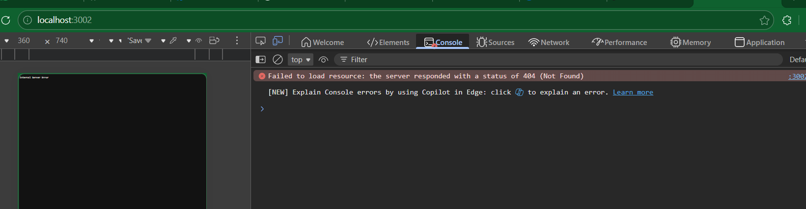
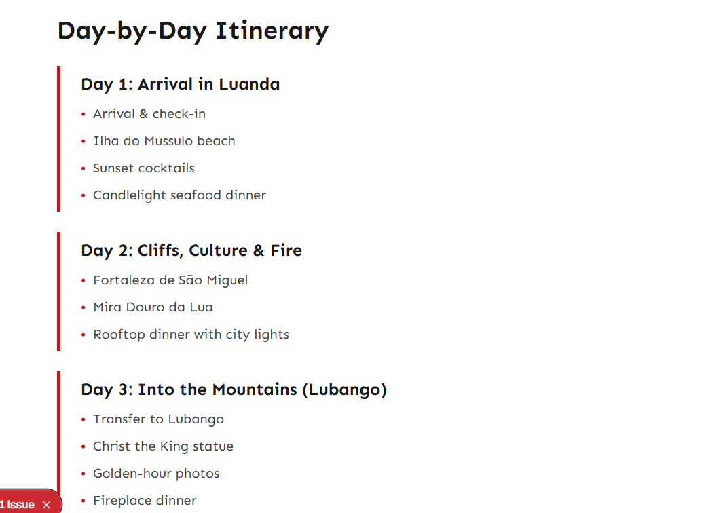

# Intare Travels - Tourism Platform

High-performance tourism platform for Rwanda with Next.js 16+, Turborepo monorepo, and full admin CMS.

## Quick Start

```bash
# Install dependencies
pnpm install

# Development
pnpm dev

# Build
pnpm build
```

**URLs:**
- Public Website: http://localhost:3000
- Admin Portal: http://localhost:3001

## Project Structure

```
intare-travels/
├── apps/
│   ├── web/          # Public website (intaretravels.rw)
│   └── admin/        # Admin CMS (admin.intaretravels.rw)
├── packages/
│   ├── ui/           # Shared components
│   ├── lib/          # SEO utilities
│   └── config/       # Shared configs
└── data/             # JSON content storage
```

## Features

### Public Website
- Tours & travel packages
- Luxury apartments
- Flight deals & promotions
- SEO-optimized (Lighthouse 95+)
- Static generation + ISR
- Mobile-first responsive

### Admin Portal
- Manage tours (add, edit, delete)
- Manage apartments
- Upload images
- Manage flight promotions
- Update airline partners
- SEO metadata editor
- FAQ management

## Admin Access

Default credentials (change in production):
- URL: http://localhost:3001
- Username: admin
- Password: (set via environment)

## Environment Variables

Create `.env.local` in both apps:

```env
# apps/web/.env.local
NEXT_PUBLIC_SITE_URL=https://intaretravels.rw

# apps/admin/.env.local
ADMIN_USERNAME=admin
ADMIN_PASSWORD=your-secure-password
```

## Deployment

### VPS Deployment (Nginx + PM2)

Deployed on your VPS with:
- **Public Site**: https://intaretravels.rw (Port 3000)
- **Admin Portal**: https://admin.intaretravels.rw (Port 3001)
- **Database**: PostgreSQL
- **Process Manager**: PM2
- **Web Server**: Nginx

### Automatic CI/CD

Push to `main` branch triggers deployment via GitHub Actions:
```bash
git push origin main
```

### Manual Deployment

```bash
# On server
cd /var/www/intaretravels
./deploy.sh
```

See `DEPLOYMENT.md` for complete VPS setup guide.

## Tech Stack

- **Framework**: Next.js 14+ (App Router)
- **Language**: TypeScript
- **Styling**: TailwindCSS
- **Monorepo**: Turborepo
- **Deployment**: Vercel
- **Storage**: JSON files (upgradeable to database)

## Performance

- Lighthouse Score: 95+
- First Contentful Paint: < 1s
- Time to Interactive: < 2.5s
- SEO Score: 100

## Content Management

Content stored in PostgreSQL database via Prisma ORM:
- Tours
- Apartments
- Flight promotions
- Airline partners

Admin portal provides full CRUD interface.

### Database Commands

```bash
# Generate Prisma client
pnpm db:generate

# Push schema changes
pnpm db:push

# Open Prisma Studio (GUI)
pnpm db:studio
```

## Development

```bash
# Run specific app
cd apps/web && pnpm dev
cd apps/admin && pnpm dev

# Lint
pnpm lint

# Type check
pnpm type-check
```

## Support

For issues or questions, contact the development team.
